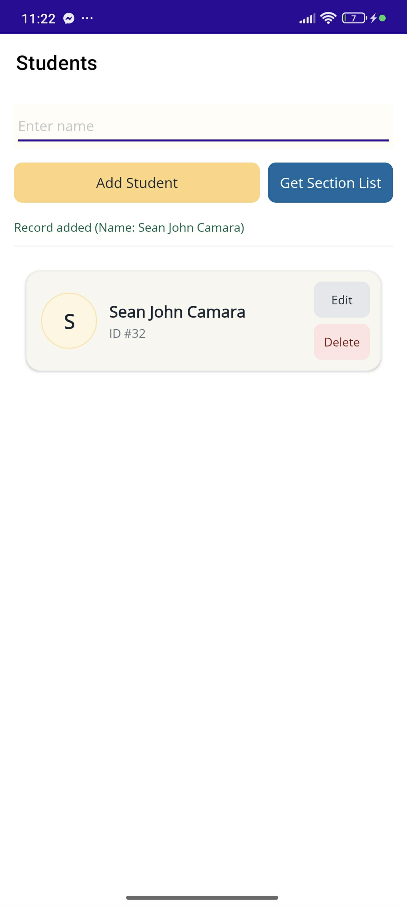
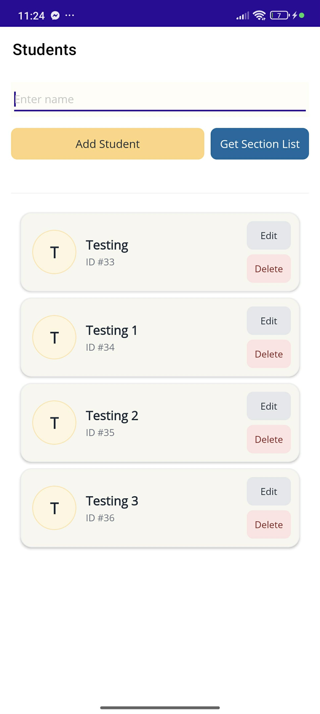

# 07 Laboratory Exercise 1

<table>
  <tr>
    <td></td>
    <td></td>
  </tr>
</table>

> 📱 **This is what the app looks like in action.**  
> You can add, edit, and delete student records with a clean, responsive UI.  
> Each student is displayed in a pale card with initials, name, ID, and action buttons — optimized for clarity and performance.

---

## Student List App — overview

This is my Student List App, a simple .NET MAUI project I built for a lab exercise. It demonstrates CRUD (Create, Read, Update, Delete) operations using SQLite and has a clean, pale card-style UI for managing student records. I focused on making the app responsive by using asynchronous database calls and incremental loading so it stays fast even with many records.

---

## Key features

- Add new student records (name + autogenerated ID)  
- Edit student names with immediate UI refresh  
- Delete student records with confirmation  
- Asynchronous database operations to avoid blocking the UI  
- Incremental paging to handle large datasets efficiently  
- Single-column card layout suitable for mobile and desktop

---

## Project layout

- `MAUIApp7/Models/Student.cs` — student data model  
- `MAUIApp7/StudentRepository.cs` — async repository with Add/Get/Update/Delete methods  
- `MAUIApp7/MainPage.xaml` — UI layout (CollectionView single-column list)  
- `MAUIApp7/MainPage.xaml.cs` — page logic with async calls, paging, and ObservableCollection updates  
- `MAUIApp7/App.xaml.cs`, `MauiProgram.cs` — app startup and dependency injection setup  
- `.gitignore` — excludes build artifacts and local DB files  
- `README.md` — this file

---

## How it works (summary)

1. The app initializes the SQLite database and ensures the Student table exists.  
2. The main page loads the first page of students (default page size 50) and loads more pages when you scroll.  
3. Add: enter a name and click **Add Student**. The app calls `AddNewStudentAsync` and inserts the new student into the list so the UI updates immediately.  
4. Edit: tap **Edit** on a card, change the name, save. The app calls `UpdateStudentAsync` and replaces the item in the collection so the list refreshes.  
5. Delete: tap **Delete**, confirm, and the app calls `DeleteStudentAsync` and removes the item from the list.

---

## Notes for developers

- MainPage expects these async repository methods:
  - `Task<Student> AddNewStudentAsync(string name)`  
  - `Task<List<Student>> GetSectionAsync(int offset = 0, int limit = 100)`  
  - `Task<bool> UpdateStudentAsync(Student student)`  
  - `Task<bool> DeleteStudentAsync(int id)`
- You can change the `PageSize` constant in `MainPage.xaml.cs` to tune how many items load per page.
- I chose to replace edited items in the ObservableCollection to force the CollectionView to refresh without making the model implement `INotifyPropertyChanged`. If you prefer smoother in-place updates, implement `INotifyPropertyChanged` on `Student`.

---

## Prerequisites

- Visual Studio 2022 (or newer) with .NET MAUI workload installed  
- .NET SDK compatible with your MAUI installation  
- (Optional) Git

---

## Run locally

1. Clone this repo:
```bash
git clone https://github.com/sean-camara/Student_List_App.git
cd Student_List_App/MAUIApp7
